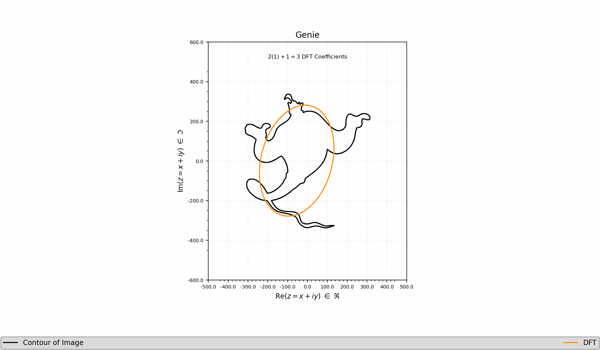

# Repo:    contour-epicycles

The purpose of this code is to make cool art using math. 

## Description

Given the path to an image, one can view the contour outline of an image. 

One can also view the epicycles of multiple connected circles tracing along the discrete Fourier transform of the contour. 

The input parameter `maximum_order` is required for indexing the discrete sums such that the number of circles is equal to `2 * maximum_order + 1` (negative indices + zero-index + positive indices). This epicycle approximation to the contour becomes more accurate as `maximum_order` $\rightarrow$ $\infty$ - though `maximum_order=10`  should be adequate for simple shapes and `maximum_order=20` should be adequate for more complicated shapes. One can also view how the discrete Fourier transform varies as a function of  `maximum_order`.

## Getting Started

### Dependencies

* Python 3.9.6
* numpy == 1.26.4
* matplotlib == 3.9.4
* scipy == 1.13.1
* scikit-image == 0.24.0
* pathlib (default)

### Executing program

* Download this repository to your local computer

* Modify `path_to_save_directory` and `paths_to_images` in  the following example codes
  
  * `src/example_01-contours.py`
  
  * `src/example_02-epicycles.py`
  
  * `src/example_03-variable_order.py`

* Change the value from `maximum_order=100` used  in the following example codes
  
  * `src/example_02-epicycles.py`
  
  * `src/example_03-variable_order.py`

* Run the example codes

## Version History

* 0.1
  * Initial Release

## License

This project is licensed under the Apache License License - see the LICENSE.md file for details.
